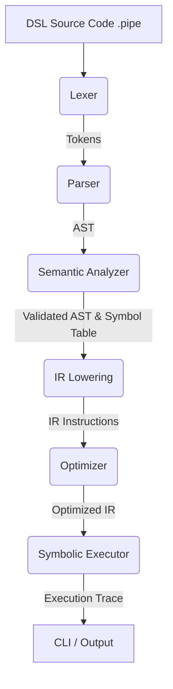

# Data Science Pipeline DSL - Phase 2 Report

## 1. Project Overview
The Data Science Pipeline DSL (Domain-Specific Language) is a custom compiler frontend designed to simplify and standardize the creation of machine learning pipelines. It addresses the complexity and boilerplate of setting up end-to-end data workflows by providing a clean, declarative language tailored specifically for tasks like loading datasets, cleaning values, selecting features, creating train/test splits, and evaluating machine learning models.

## 2. Phase 1 Recap
Before Phase 2, the project existed as a single-file prototype (`initial_prototype.py`) which grouped the lexer, parser, AST structures, and a semantic analyzer into one monolithic script. This early iteration proved the viability of the language grammar and logic but lacked modularity, intermediate representations, optimizations, an executor, and testing infrastructure.

## 3. Phase 2 Scope & Objectives
The objectives of Phase 2 focused on transforming the prototype into a structured, modular compiler architecture. The goals were to:
- Refactor the monolith into a proper Python package (`ds_pipeline_dsl`) with separated modules.
- Introduce an Intermediate Representation (IR) generation stage (`lower_to_ir`).
- Implement an Optimizer to collapse redundant statements and drop unreachable code.
- Create a Symbolic Executor to provide a human-readable execution trace.
- Expose a fully-featured Command-Line Interface (`cli.py`) for inspecting each compiler stage.
- Establish a rigorous automated test suite covering all compiler stages and error states.

## 4. System Architecture
The pipeline now follows a standard multi-pass compiler architecture:



## 5. Module-wise Implementation Details

### `__init__.py`
- **Purpose**: Marks the `src/ds_pipeline_dsl/` directory as a Python package.

### `ast_nodes.py`
- **Purpose**: Defines the Abstract Syntax Tree (AST) node structures.
- **Data Structures**: Dataclasses like `PipelineNode`, `LoadStmt`, `CleanStmt`, `SplitStmt`, `TrainStmt`, `EvaluateStmt`.
- **Core Logic**: Provides purely structural representation of a parsed pipeline and its statements.
- **Interaction**: Instantiated by the parser and traversed by the semantic analyzer and IR lowerer.

### `lexer.py`
- **Purpose**: Converts a raw string of DSL code into a sequential stream of tokens.
- **Data Structures**: A `Token` namedtuple and a list of regex rules defining token patterns.
- **Core Logic**: Applies regex matches iteratively over the input string, discarding whitespace/comments and emitting `Token` objects. Raises a `LexicalError` on invalid characters.
- **Interaction**: Feeds the resulting token list into the parser.

### `parser.py`
- **Purpose**: Constructs an Abstract Syntax Tree (AST) from the token stream.
- **Data Structures**: A recursive-descent `Parser` class.
- **Core Logic**: Uses `peek()`, `advance()`, and `expect()` methods to match tokens against the expected DSL grammar. Raises a `SyntaxError_` if the tokens violate the grammar.
- **Interaction**: Takes input from the lexer and passes its output (`PipelineNode`) to the semantic analyzer.

### `semantic.py`
- **Purpose**: Validates the logical correctness of the AST.
- **Data Structures**: `SymbolTable` to track defined datasets, splits, and models.
- **Core Logic**: Traverses the AST statements, ensuring operations are logically ordered (e.g., you cannot `train` before `split` and percentages must strictly fall between 0 and 100). Raises a `SemanticError` upon violations.
- **Interaction**: Analyzes the AST produced by the parser before it is lowered to IR.

### `ir.py`
- **Purpose**: Lowers the hierarchical AST into a flat Intermediate Representation (IR).
- **Data Structures**: `IRInstruction` dataclass containing an opcode `op` and a dictionary of `args`.
- **Core Logic**: Maps each AST statement node into exactly one corresponding `IRInstruction` sequentially.
- **Interaction**: Receives the validated AST and outputs an IR instruction list to the optimizer.

### `optimizer.py`
- **Purpose**: Improves the efficiency of the compiled code by transforming the IR.
- **Data Structures**: Modifies a sequential list of `IRInstruction` objects.
- **Core Logic**: Applies two passes simultaneously: collapsing immediately consecutive duplicate instructions (e.g., redundant `OP_CLEAN` or `OP_SELECT` with identical arguments) and stripping unreachable instructions that follow an `OP_EVAL` instruction.
- **Interaction**: Takes unoptimized IR from `ir.py` and provides optimized IR to the executor.

### `executor.py`
- **Purpose**: Performs a symbolic execution of the optimized IR.
- **Data Structures**: Generates and returns a list of human-readable trace strings.
- **Core Logic**: Iterates over the optimized IR list and maps each opcode to a formatted, declarative status message.
- **Interaction**: Acts as the final endpoint of the compilation pipeline, translating machine-like IR back to the user context.

### `cli.py`
- **Purpose**: Provides a user-facing command-line interface.
- **Data Structures**: Utilizes `argparse` for flag evaluation.
- **Core Logic**: Orchestrates the entire compiler pipeline. Captures specific exceptions (`LexicalError`, `SyntaxError_`, `SemanticError`) to display clean error messages without raw Python tracebacks, and selectively prints data from intermediate stages (`--tokens`, `--ast`, `--ir`, `--optimized-ir`, `--trace`).
- **Interaction**: The entrypoint that coordinates and executes all compiler modules.

## 6. Compiler Design Concepts Applied

| Concept | Implemented By Module |
|---|---|
| **Lexical Analysis** | `lexer.py` |
| **Syntax Analysis / Parsing** | `parser.py` |
| **Abstract Syntax Tree** | `ast_nodes.py`, `parser.py` |
| **Semantic Analysis** | `semantic.py` |
| **Intermediate Code Generation** | `ir.py` |
| **Code Optimization** | `optimizer.py` |
| **Symbolic Execution** | `executor.py` |
| **Error Handling** | `cli.py`, `lexer.py`, `parser.py`, `semantic.py` |
| **Command-Line Interface** | `cli.py` |

## 7. Test Cases & Results

| Test File | Verified Behavior | Tests | Status |
|---|---|---|---|
| `test_lexer.py` | Valid token generation, correct error handling for illegal characters. | 2 | Passed |
| `test_parser.py` | AST node construction, syntax error generation for missing elements. | 2 | Passed |
| `test_semantic.py` | Valid logical flows, split bounds checks, missing prerequisites (e.g., train before split). | 3 | Passed |
| `test_ir.py` | Correct generation of flat opcodes and preserved sequential ordering from AST to IR. | 1 | Passed |
| `test_optimizer.py` | Elimination of exact duplicate operations, stripping of dead code following evaluations. | 3 | Passed |
| `test_executor.py` | Proper formatting and generation of the final symbolic trace. | 1 | Passed |
| `test_cli.py` | Argument flag ingestion, pipeline stage visualization, gracefully catching and formatting compilation errors. | 3 | Passed |
| `test_examples.py` | End-to-end execution of the 4 `.pipe` file examples in the repository verifying expected successes and failures. | 4 | Passed |

**Overall Result**: 19 / 19 tests passed (0.07s).

## 8. Functional Demonstration

The repository includes four `.pipe` files under `examples/` demonstrating various scenarios. You can run them via the CLI:

1. **Valid Basic Pipeline**:
```bash
python -m ds_pipeline_dsl.cli examples/valid_basic.pipe
```
*Expected Output*: Prints all 5 stages (Tokens, AST, IR, Optimized IR, and Trace) concluding with the successful 6-line evaluation trace.

To only view the trace:
```bash
python -m ds_pipeline_dsl.cli examples/valid_basic.pipe --trace
```

2. **Semantic Error (Train Before Split)**:
```bash
python -m ds_pipeline_dsl.cli examples/invalid_train_before_split.pipe
```
*Expected Output*: `Semantic Error at line 5: training data has not been defined...` (execution halts gracefully).

3. **Lexical Error (Invalid Character)**:
```bash
python -m ds_pipeline_dsl.cli examples/invalid_lexical_error.pipe
```
*Expected Output*: `Lexical Error at line 2, col 9: unexpected character '@'` (execution halts gracefully).

4. **Syntax Error (Missing Semicolon)**:
```bash
python -m ds_pipeline_dsl.cli examples/invalid_syntax_error.pipe
```
*Expected Output*: `Syntax Error at line 3: expected SEMI, found CLEAN ('clean')` (execution halts gracefully).

## 9. Known Limitations
- **The executor is purely symbolic**: Execution produces human-readable trace statements rather than performing actual machine learning operations.
- **No real datasets are loaded**: The compiler references data files for validation but does not read file contents.
- **No real model training or prediction**: The models evaluated are placeholder simulations.
- **Limited Optimization**: The optimizer implements solely the duplicate-collapse and unreachable-code-removal rules currently defined in `optimizer.py`.

## 10. Future Enhancements — Phase 3 Roadmap
- **Real CSV Loading**: Integrating data parsing logic, potentially utilizing `pandas`, to turn string literals into in-memory DataFrames.
- **Real ML Execution**: Generating Python scripts or orchestrating `scikit-learn` instances to genuinely split, train, and evaluate datasets.
- **Advanced Optimization Passes**: Expanding the optimizer to reorder independent tasks (e.g., executing multiple independent cleans concurrently) or statically evaluate constant expressions.
- **DSL Construct Expansion**: Supporting hyperparameter declarations, dataset joining, cross-validation mechanisms, and additional machine learning algorithms.

## 11. Source Code Access
The complete source code for this project is available on GitHub:
[https://github.com/Sinchana-B-Kurkuri/A-Domain-Specific-Language-and-Compiler-Front-End-for-Data-Science-Pipelines](https://github.com/Sinchana-B-Kurkuri/A-Domain-Specific-Language-and-Compiler-Front-End-for-Data-Science-Pipelines)

## 12. Conclusion
Phase 2 effectively evolved the Data Science Pipeline DSL from a proof-of-concept into a robust, structured compiler frontend. By introducing an intermediate representation, an optimization pass, and extensive testing, the `ds_pipeline_dsl` package sets a strong foundation for future backend execution capabilities.
